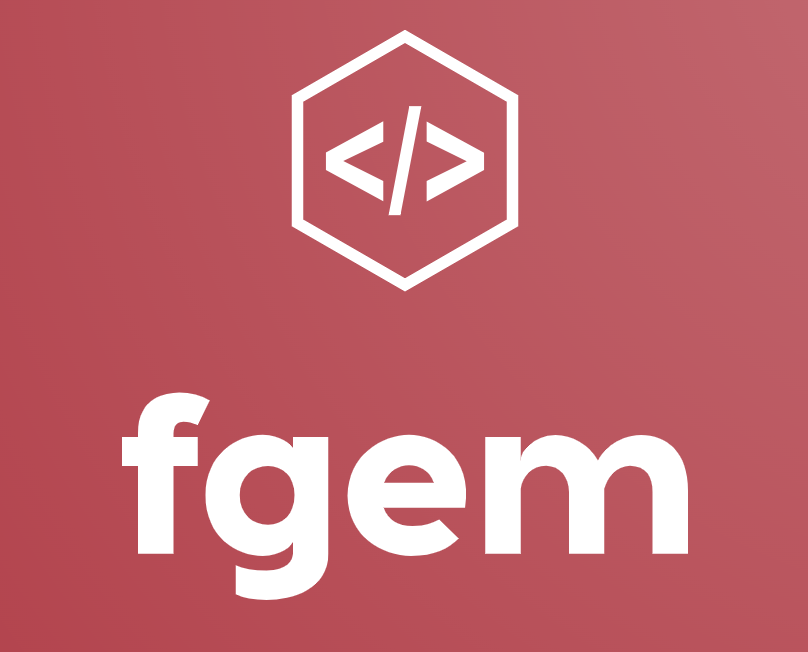

<!--
Hey, thanks for using the awesome-readme-template template.  
If you have any enhancements, then fork this project and create a pull request 
or just open an issue with the label "enhancement".

Don't forget to give this project a star for additional support ;)
Maybe you can mention me or this repo in the acknowledgements too
-->
<div align="center">

  
<h1>Flexible Geothermal Economic Modeling</h1>
  
<!--   <p>
    Flexible Geothermal Economic Modeling 
  </p> -->
  
  
<!-- Badges -->
<!-- <p>
  <a href="https://github.com/Louis3797/awesome-readme-template/graphs/contributors">
    
  </a>
  <a href="">
    
  </a>
  <a href="https://github.com/Louis3797/awesome-readme-template/network/members">
    
  </a>
  <a href="https://github.com/Louis3797/awesome-readme-template/stargazers">
    
  </a>
  <a href="https://github.com/Louis3797/awesome-readme-template/issues/">
    
  </a>
  <a href="https://github.com/Louis3797/awesome-readme-template/blob/master/LICENSE">
    
  </a>
</p> -->
   
<!-- <h4>
    <a href="https://github.com/Louis3797/awesome-readme-template/">View Demo</a>
  <span> · </span>
    <a href="https://github.com/Louis3797/awesome-readme-template">Documentation</a>
  <span> · </span>
    <a href="https://github.com/Louis3797/awesome-readme-template/issues/">Report Bug</a>
  <span> · </span>
    <a href="https://github.com/Louis3797/awesome-readme-template/issues/">Request Feature</a>
  </h4> -->
</div>

<br />

<!-- Table of Contents -->
# :notebook_with_decorative_cover: Table of Contents

- [About the Project](#star2-about-the-project)
- [Getting Started](#toolbox-getting-started)
- [Contributing](#wave-contributing)
- [License](#warning-license)
- [Contact](#handshake-contact)
  
<!-- About the Project -->
## :star2: About the Project
This work is based on a [journal article published in Applied Energy](https://doi.org/10.1016/j.apenergy.2023.122125).
This was developed in the Stanford Geothermal Program to serve as a tool for evaluating the techno-economics of flexible geothermal operations. It makes use of anlytical and iterative models alongside correlations develoepd in other works[^1][^2][^3]. It involves the techno-economic modeling of thermal energy storage and battery units towards flexible generation.

<!-- Screenshots -->
<!-- ### :camera: Screenshots

<div align="center"> 
  
</div>


<!-- TechStack -->
<!-- ### :space_invader: Tech Stack

<details>
  <summary>Client</summary>
  <ul>
    <li><a href="https://www.typescriptlang.org/">Typescript</a></li>
    <li><a href="https://nextjs.org/">Next.js</a></li>
    <li><a href="https://reactjs.org/">React.js</a></li>
    <li><a href="https://tailwindcss.com/">TailwindCSS</a></li>
  </ul>
</details> -->

<!-- <details>
  <summary>Server</summary>
  <ul>
    <li><a href="https://www.typescriptlang.org/">Typescript</a></li>
    <li><a href="https://expressjs.com/">Express.js</a></li>
    <li><a href="https://go.dev/">Golang</a></li>
    <li><a href="https://nestjs.com/">Nest.js</a></li>
    <li><a href="https://socket.io/">SocketIO</a></li>
    <li><a href="https://www.prisma.io/">Prisma</a></li>    
    <li><a href="https://www.apollographql.com/">Apollo</a></li>
    <li><a href="https://graphql.org/">GraphQL</a></li>
  </ul>
</details> -->

<!-- <details>
<summary>Database</summary>
  <ul>
    <li><a href="https://www.mysql.com/">MySQL</a></li>
    <li><a href="https://www.postgresql.org/">PostgreSQL</a></li>
    <li><a href="https://redis.io/">Redis</a></li>
    <li><a href="https://neo4j.com/">Neo4j</a></li>
    <li><a href="https://www.mongodb.com/">MongoDB</a></li>
  </ul>
</details> -->

<!-- <details>
<summary>DevOps</summary>
  <ul>
    <li><a href="https://www.docker.com/">Docker</a></li>
    <li><a href="https://www.jenkins.io/">Jenkins</a></li>
    <li><a href="https://circleci.com/">CircleCLI</a></li>
  </ul>
</details> -->

<!-- Features -->
<!-- ### :dart: Features

- Feature 1
- Feature 2
- Feature 3 -->

<!-- Color Reference -->
<!-- ### :art: Color Reference

| Color             | Hex                                                                |
| ----------------- | ------------------------------------------------------------------ |
| Primary Color |  #222831 |
| Secondary Color |  #393E46 |
| Accent Color |  #00ADB5 |
| Text Color |  #EEEEEE |
 -->

<!-- Env Variables -->
<!-- ### :key: Environment Variables

To run this project, you will need to add the following environment variables to your .env file

`API_KEY`

`ANOTHER_API_KEY` --> 

<!-- Getting Started -->
## 	:toolbox: Getting Started

### :eight_spoked_asterisk: Run on Google Colab (No Local Installation)
Follow this [Google Colab LINK](https://colab.research.google.com/drive/1nHoqSLD8QRXfB_kHNa67VRN8kE4dkjmm?usp=sharing) 

<!-- Prerequisites -->
### :gear: Local Installation

1. Create a Python 3.8 or newer virtual environment
   *If you're not sure how to create a suitable Python environment, the easiest way is using [Miniconda](https://docs.conda.io/en/latest/miniconda.html). On a Mac, for example, you can install Miniconda using [Homebrew](https://brew.sh/):*

    ```
    brew install miniconda
    ```

    *Then you can create and activate a new Python environment by running:*

    ```
    conda create -n my-package python=3.9
    conda activate my-package
    ```
2. Clone the FGEM github repositary, change directories, and install the required Python packages by running the following:

```bash
git clone https://github.com/aljubrmj/FGEM
cd FGEM
pip install -r requirements.txt
```
<!-- Running Tests -->
### :test_tube: Running Tests

To run tests, run the following command in the FGEM directory

```bash
  python example.py
```

<!-- Usage -->
<!-- ## :eyes: Usage

Use this space to tell a little more about your project and how it can be used. Show additional screenshots, code samples, demos or link to other resources.


```javascript
import Component from 'my-project'

function App() {
  return <Component />
}
``` -->

<!-- Roadmap -->
<!-- ## :compass: Roadmap

* [x] Todo 1
* [ ] Todo 2 -->


<!-- Contributing -->
## :wave: Contributing

<!-- <a href="https://github.com/Louis3797/awesome-readme-template/graphs/contributors">
  
</a> -->


Contributions are always welcome!

<!-- See `contributing.md` for ways to get started. -->


<!-- Code of Conduct -->
<!-- ### :scroll: Code of Conduct

Please read the [Code of Conduct](https://github.com/Louis3797/awesome-readme-template/blob/master/CODE_OF_CONDUCT.md) -->

<!-- FAQ -->
<!-- ## :grey_question: FAQ

- Question 1

  + Answer 1

- Question 2

  + Answer 2 -->


<!-- License -->
## :warning: License

Distributed under the MIT License. See LICENSE.txt for more information.


<!-- Contact -->
## :handshake: Contact

Mohammad Aljubran - [LinkedIn](https://www.linkedin.com/in/mohammad-aljubran) - [Scholar](https://scholar.google.com/citations?user=7-YoZS8AAAAJ&hl=en)- aljubrmj@stanford.edu; m.j.aljubran@gmail.com

<!-- Acknowledgments -->
<!-- ## :gem: Acknowledgements

Correlations used in this model across both upstream and downstream components are based on GETEM and GEOPHIRES. -->

[^1]: Aljubran, M. J., & Horne, R. N. (2024). FGEM: Flexible Geothermal Economics Modeling tool. Applied Energy, 353, 122125.
[^2]: Mines, G. L. (2016). GETEM User Manual. INL: Idaho Falls, ID, USA.
[^3]: Beckers, K. F., & McCabe, K. (2019). GEOPHIRES v2. 0: updated geothermal techno-economic simulation tool. Geothermal Energy, 7, 1-28.
