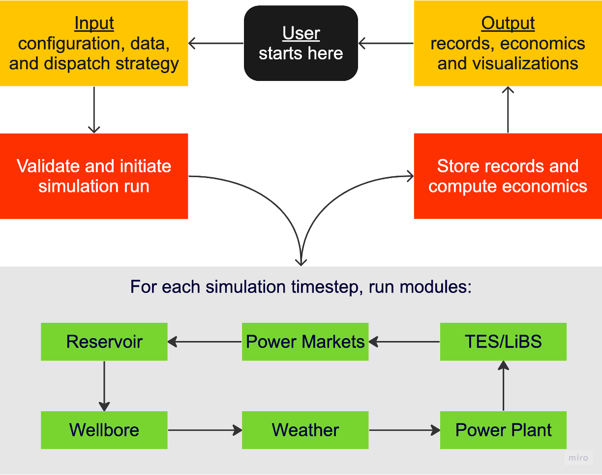

<!--
Hey, thanks for using the awesome-readme-template template.  
If you have any enhancements, then fork this project and create a pull request 
or just open an issue with the label "enhancement".

Don't forget to give this project a star for additional support ;)
Maybe you can mention me or this repo in the acknowledgements too
-->

<div align="center"> 
  
</div>


## See our [readthedocs](https://fgem.readthedocs.io/en/latest/about-introduction.html) for installation and usage instructions. For quick runs with no local installation, visit our [Google Colab notebook](https://colab.research.google.com/drive/1nHoqSLD8QRXfB_kHNa67VRN8kE4dkjmm?usp=sharing#scrollTo=o7q75t8UiyKX).

**FGEM** (/if'gem/), Flexible Geothermal Economics Model, is an open-source Python library for evaluating lifecycle techno-economics of baseload and flexible geothermal energy projects. 
It performs sequential simulations spanning hourly to yearly timestepping using anlytical, numerical, and iterative models. 
It also simulates hybrid systems involving storage facilities (e.g., thermal energy storage tanks and Lithium-ion battery units. 
For more technical details, you may refer to our [Applied Energy Journal Article](https://doi.org/10.1016/j.apenergy.2023.122125).

<br />
<div align="center">
  
</div>
 <br />

# Contributing

We welcome your contributions to this project. Please see the [contributions](https://fgem.readthedocs.io/en/latest/reference_contribution.html) guide in our readthedocs page for more information. Please do not hesitate to contact aljubrmj@stanford.edu with specific questions, requests, or feature ideas.

# License

The project is licensed under MIT License. See LICENSE.txt for more information.

# Citation

Please cite our Journal Article:

```
@article{aljubran2024fgem,
  title={FGEM: Flexible Geothermal Economics Modeling tool},
  author={Aljubran, MJ and Horne, Roland N},
  journal={Applied Energy},
  volume={353},
  pages={122125},
  year={2024},
  publisher={Elsevier}
}
```
