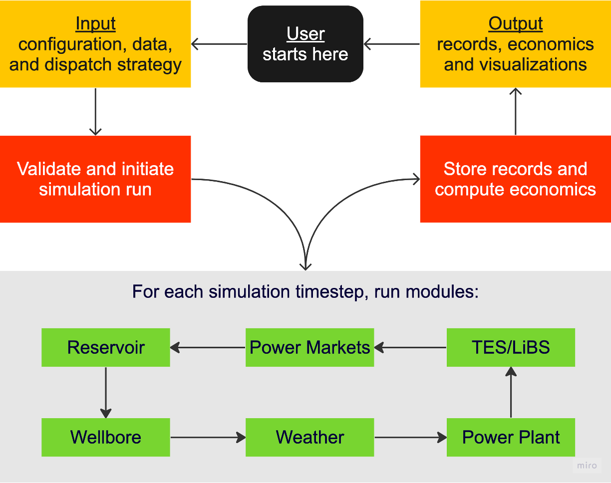

# Introduction

```{warning}
**FGEM is under active development. For more information, please reach out to aljubrmj@stanford.edu for support**
```

**FGEM** (/if'gem/) is an open-source Python library for evaluating lifecycle techno-economics of baseload and flexible geothermal energy projects. It performs sequential simulations spanning hourly to yearly timestepping using anlytical, numerical, and iterative models. It also simulates hybrid systems involving storage facilities (e.g., thermal energy storage tanks and Lithium-ion battery units. For more technical details, you may refer to our [Applied Energy Journal Article](https://doi.org/10.1016/j.apenergy.2023.122125).
\
<div align="center">
  
</div>
\
**FGEM** allows the user to manipulate a configuration file, data files, and dispatch strategy to simulate their project. These inputs are then validated and used to initiate the simulation run. FGEM then loops over multiple modules, each modeling the techno-economics of the system components: subsurface reservoir, wellbore, weather, power plant (single flash or binary), energy storage (thermal and/or electrochemical), and power markets (wholesale, capacity, green credits, and/or PPA). Upon the end of the simulated project lifetime, records are stored, economics are computed, and various quantities are visualized.

Contents
--------

```{toctree}
:caption: 'Usage:'
:maxdepth: 1
:hidden:

usage
```

```{toctree}
:caption: 'API:'
:maxdepth: 1
:hidden:

api
```
