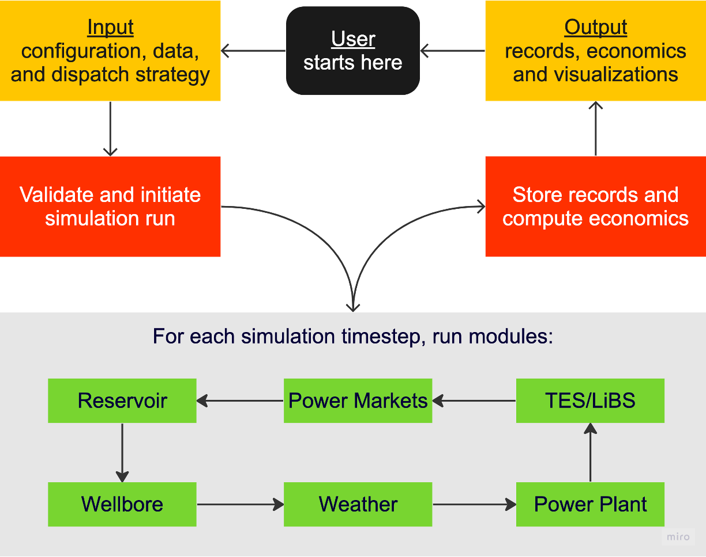

Welcome to FGEM's documentation!
===================================

**FGEM** (/if'gem/) is an open-source Python library for evaluating lifecycle techno-economics of baseload and flexible geothermal energy projects. It performs sequential simulations spanning hourly to yearly timestepping using anlytical, numerical, and iterative models. It also simulates hybrid systems involving storage facilities (e.g., thermal energy storage tanks and Lithium-ion battery units).

It pulls data from the `Open Food Facts database <https://world.openfoodfacts.org/>`_
and offers a *simple* and *intuitive* API.

Check out the :doc:`usage` section for further information, including
how to :ref:`installation` the project.

.. note::

   This project is under active development.

Contents
--------

.. toctree::

   usage
   api
